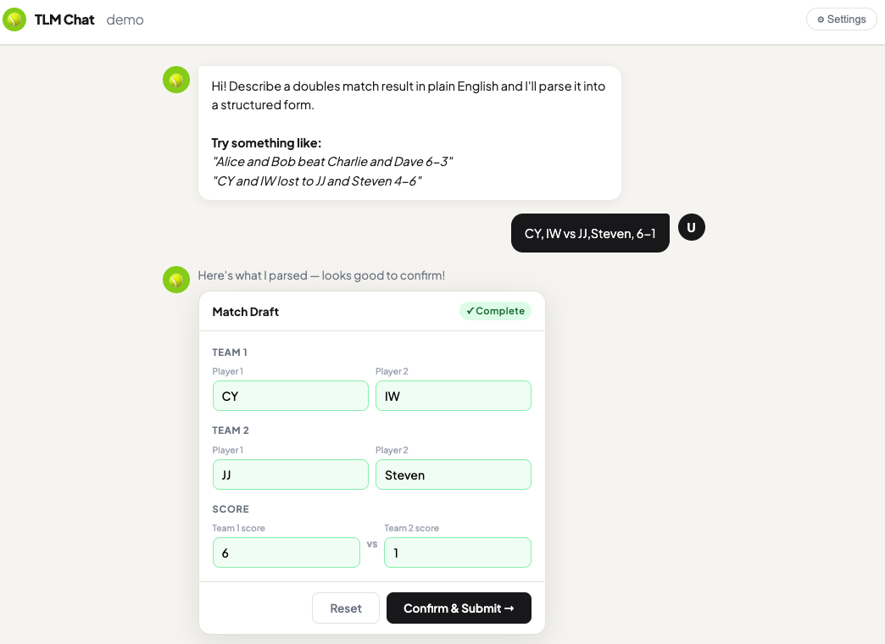
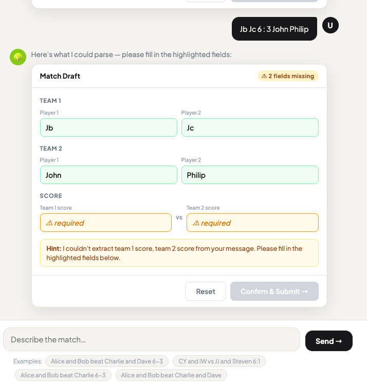

# Tennis League Chatbot — LLM Backend

A lightweight **FastAPI** service that accepts a free-text doubles match description from the chatbot frontend, parses it with a configurable LLM provider, and returns a structured draft ready for the player to review and confirm.

---

## Demo

**Complete parse** — all four player names and the score were extracted; the confirmation form is pre-filled and ready to submit.



**Partial parse** — player names were resolved but the score could not be extracted; missing fields are highlighted with a hint message.



---

## How It Works

```
Frontend chat input
      │
      ▼
POST /parse-match
      │  { league_id, message }
      ▼
LLM Provider  ──►  MatchDraft
      │               (team names, scores, missing_fields, hint)
      ▼
ParseMatchResponse  ──►  Frontend confirmation form
```

1. The player types a natural-language match result (e.g. *"CY and IW vs JJ and Steven 6–1"*).
2. The backend parses it using the active provider and returns a `ParseMatchResponse`.
3. If `missing_fields` is **empty**, the draft is fully resolved and the frontend can forward it to `backend_main` after the player confirms.
4. If `missing_fields` is **non-empty**, the frontend highlights the unresolved slots and shows the `hint` message so the player can fill them in.

---

## API

### `POST /parse-match`

**Request**

```json
{
  "league_id": "550e8400-e29b-41d4-a716-446655440000",
  "message": "Alice and Bob beat Charlie and Dave 6-3"
}
```

**Response**

```json
{
  "league_id": "550e8400-e29b-41d4-a716-446655440000",
  "raw_message": "Alice and Bob beat Charlie and Dave 6-3",
  "draft": {
    "team1_nicknames": ["Alice", "Bob"],
    "team2_nicknames": ["Charlie", "Dave"],
    "team1_score": "6",
    "team2_score": "3"
  },
  "missing_fields": [],
  "hint": null
}
```

When a slot cannot be extracted, it is `null` and its identifier (e.g. `"team1_score"`, `"team2_nicknames[1]"`) appears in `missing_fields`.

Interactive docs are available at `http://localhost:8001/docs` once the server is running.

---

## LLM Providers

Set `LLM_PROVIDER` in `.env` to switch providers at startup. The provider is instantiated once and reused across all requests.

| `LLM_PROVIDER` | Description | Required env var |
|---|---|---|
| `demo` *(default)* | Regex-based, no API key needed | — |
| `openai` | OpenAI chat completions | `OPENAI_API_KEY`, `OPENAI_MODEL` |
| `google` | Google Gemini | `GOOGLE_API_KEY`, `GOOGLE_MODEL` |
| `groq` | Groq (Llama / Mixtral, low latency) | `GROQ_API_KEY`, `GROQ_MODEL` |

All providers implement the same `LLMProvider` abstract interface and return a `MatchDraft` dataclass — swapping providers requires only a one-line `.env` change.

---

## Project Structure

```
backend_llm/
├── app/
│   ├── main.py                          # FastAPI app, CORS, lifespan
│   ├── dependencies.py                  # Provider selection via LLM_PROVIDER
│   ├── api/
│   │   ├── routers/
│   │   │   └── parse_match_router.py    # POST /parse-match endpoint
│   │   └── schemas/
│   │       └── parse_match_schemas.py   # Pydantic request/response models
│   └── llm/
│       ├── provider_interface.py        # Abstract LLMProvider + MatchDraft
│       ├── demo_provider.py             # Regex-based provider (no API key)
│       └── providers/
│           ├── openai_provider.py
│           ├── google_provider.py
│           └── groq_provider.py
├── .env                                 # Provider selection & API keys
├── requirements.txt
└── Procfile                             # Heroku / Railway deployment
```

---

## Setup

### 1. Create and activate a virtual environment

```bash
python -m venv .venv
source .venv/bin/activate
```

### 2. Install dependencies

```bash
pip install -r requirements.txt
```

### 3. Configure `.env`

```dotenv
# Provider: demo | openai | google | groq
LLM_PROVIDER=demo

# Groq
# GROQ_API_KEY=gsk_...
# GROQ_MODEL=llama-3.1-8b-instant

# OpenAI
# OPENAI_API_KEY=sk-...
# OPENAI_MODEL=gpt-4o-mini

# Google Gemini
# GOOGLE_API_KEY=...
# GOOGLE_MODEL=gemini-1.5-flash
```

### 4. Run the server

```bash
uvicorn app.main:app --reload --port 8001
```

---

## Deployment

A `Procfile` is included for Heroku / Railway:

```
web: uvicorn app.main:app --host 0.0.0.0 --port $PORT
```

Set all required environment variables in the platform's dashboard before deploying.

---

## Dependencies

| Package | Purpose |
|---|---|
| `fastapi` | Web framework |
| `uvicorn[standard]` | ASGI server |
| `pydantic` | Request/response validation |
| `python-dotenv` | `.env` loading |
| `groq` | Groq async client |
